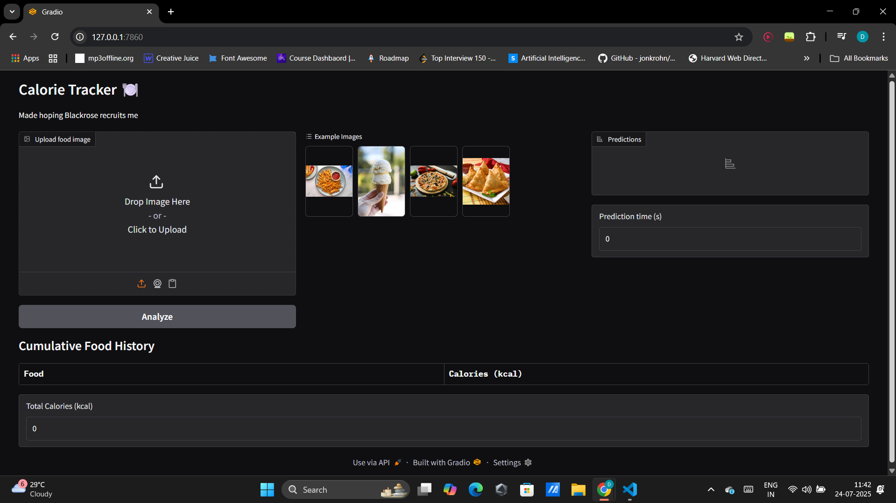
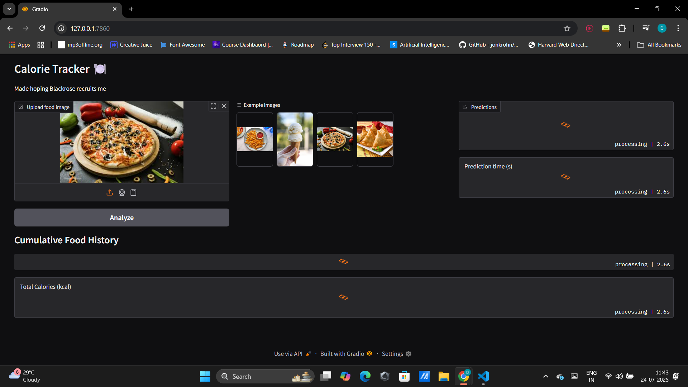
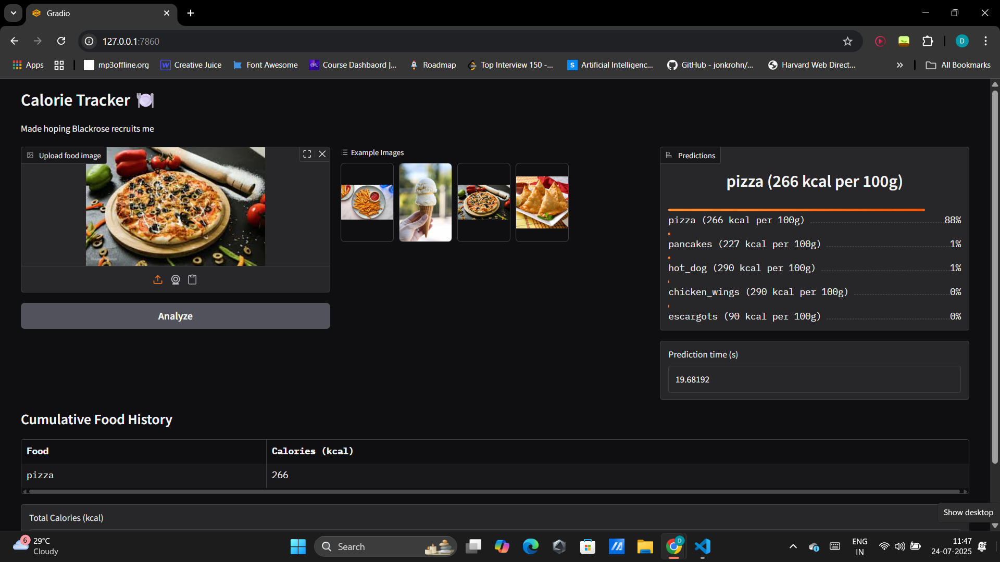
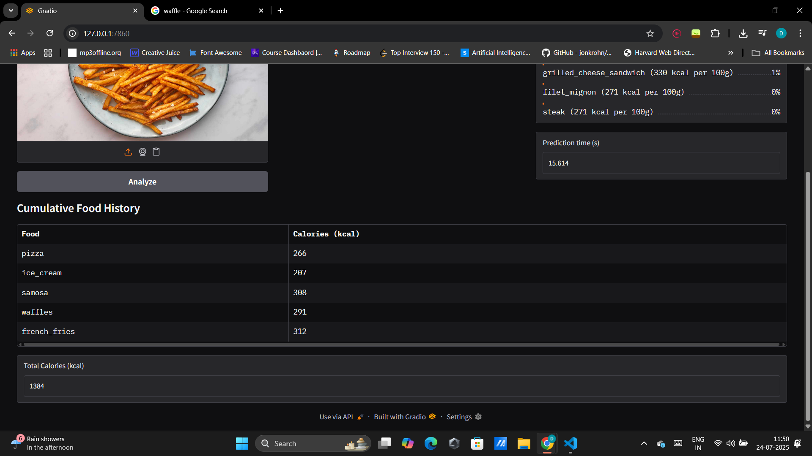

# Calorie Tracker

This is an AI calorie tracker software. Built using effnetb2. Fine tuned 6 Million+ parameters over the Food 101 dataset which contains 100,000 images of 101 classes of food.

Trained for 50 epochs and achieved an accuracy of ~86%
Added a Gradio UI that can take single images as input and used the trained model to predict what to food item is. 

Used USDA api to extract calorie data for food items. If USDA API call fails we have a backup api call for World Food Facts. Incase of another failed api call via World Food Facts we have hardcoded calorie values for for the 101 classes.

The  UI has a tracks all the food items consumed by the user and gives a total calorie in take table as well.

Following are the screenshots of the running WebPage

